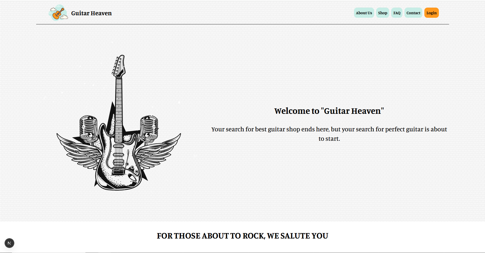
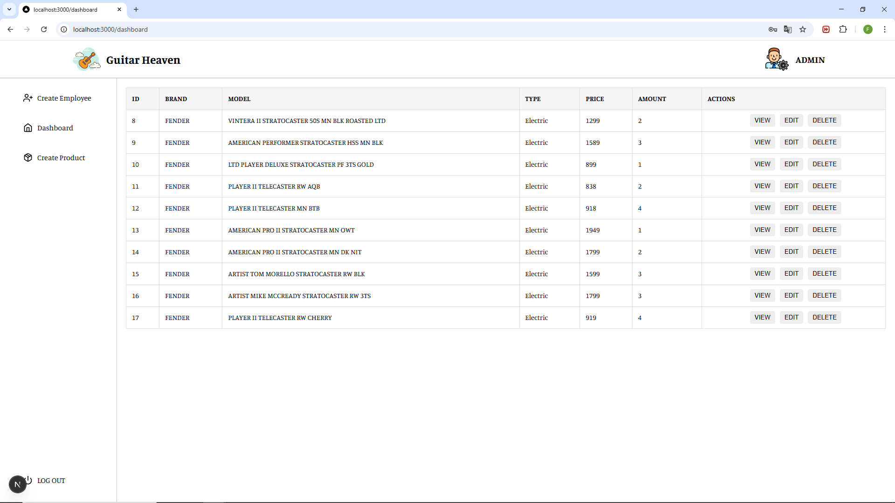

# GUITAR HEAVEN - Web Shop

A full-stack web application for an online guitar shop, including an admin panel for managing guitar inventory in the warehouse.

## UNDER DEVELOPMENT

This appliaction is currently under development.

## TECHNOLOGIES

- **Frontend**: React (Next.js), SCSS (BEM)
- **Backend**: Spring Boot (Java)
- **Database**: MySQL
- **Auth**: JWT

## SNEAK PEEK
Welcome page

Admin panel

## DESCRIPTION OF THE APPLICATION

The application is designed as a web shop for selling guitars. It also serves as a system for tracking guitar inventory in the warehouse. Administrators have access to all inventory data and can perform standard CRUD operations. Employees can also access the data, but with limited permissions. Customers can browse and purchase products.
