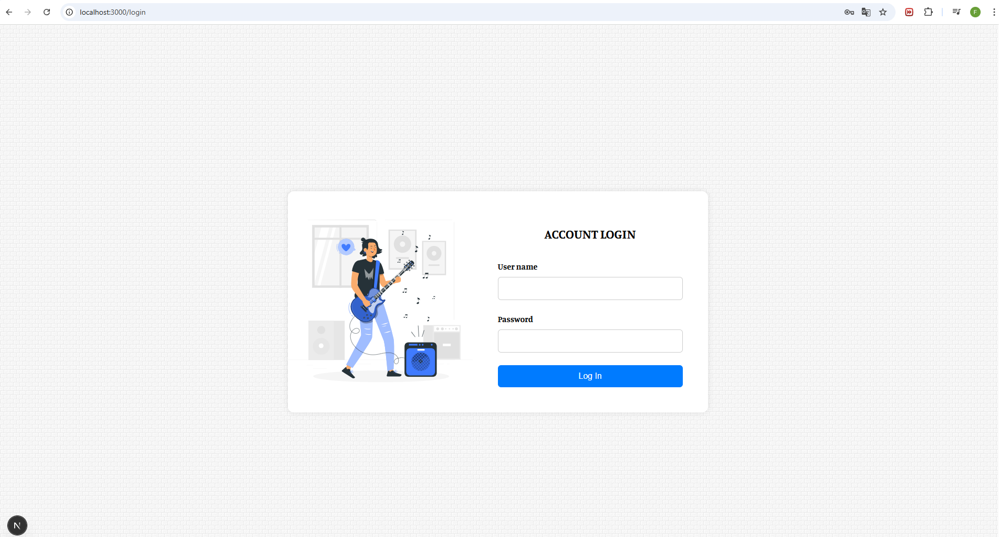
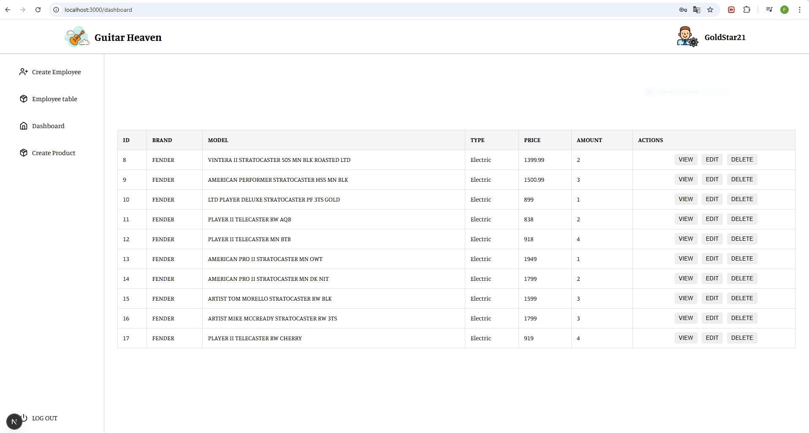
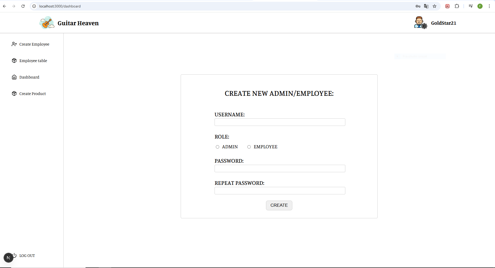
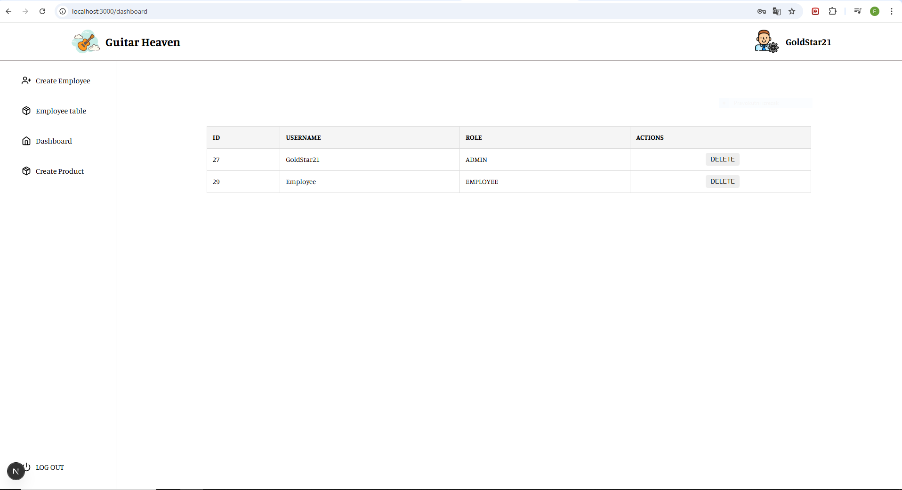
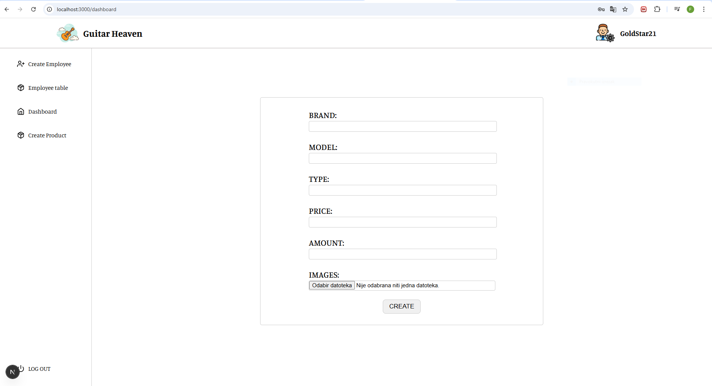
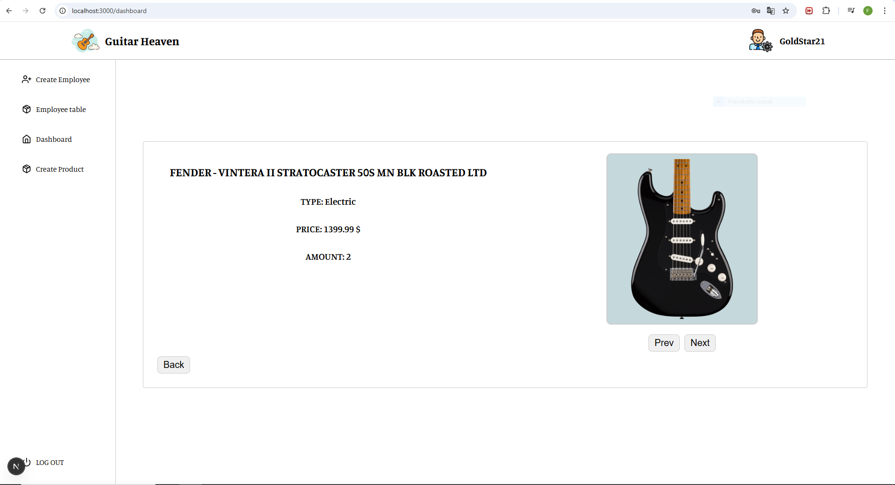
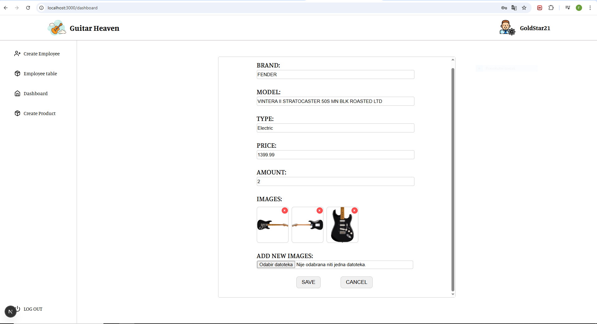
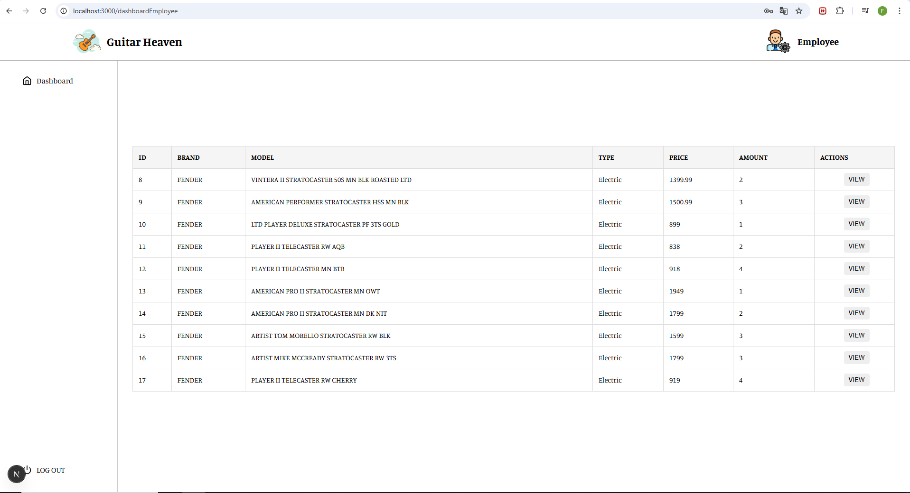
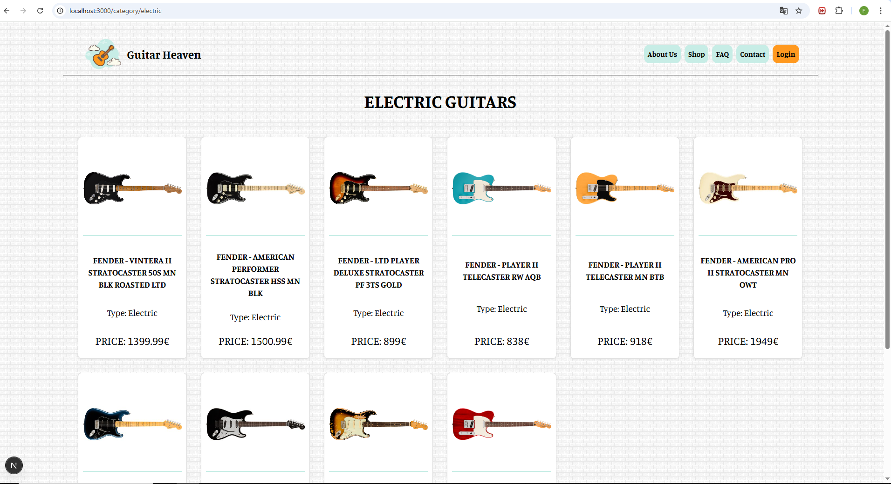
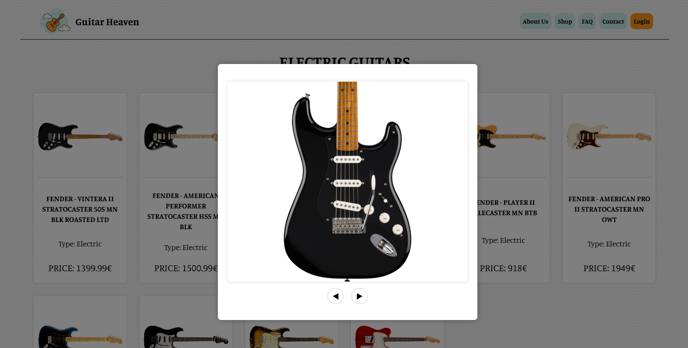

# GUITAR HEAVEN - Web Shop

A full-stack web application for an online guitar shop, including an admin and employee panel for managing guitar inventory in the warehouse.

## UNDER DEVELOPMENT

This appliaction is currently under development.
I======= 90% =======I

## TECHNOLOGIES

- **Frontend**: React (Next.js), SCSS (BEM)
- **Backend**: Spring Boot (Java)
- **Database**: MySQL
- **Auth**: JWT
- **Docker**

## HOW TO START APPLICATION

To run this application all you need to have is Docker (Docker desktop) installed, and IDE (I use Intellij IDEA Community).

**Clone the project and import it into your IDE**

**Stop any local services if they're running (especially MySQL):** If you encounter database connection issues, either change the port in application.properties and docker-compose.yml, or make sure your local MySQL service is turned off.

**The project should build automatically:** If prompted, approve any requests (e.g. Maven setup or Docker permissions).

**In the terminal, run:** docker-compose up.␣␣   
If for some reason the automatic build was not triggered, use docker-compose up --build.

**Login credentials**
**Admin:**
Username: Admin21
Password: Admin1234 

**Employee:**
Username: Employee21
Password: Employee1234

There are no products in the database by default, but you can try adding one — the functionality works.

**To stop the application:** docker-compose down

## SNEAK PEEK
Welcome page

Login page 

Admin panel

Admin panel: create new Admin/Employee form

Admin panel: Admin/Employee table

Admin panel: create product form

Admin panel: view product

Admin panel: edit product

Employee panel

Example of electric guitars sections:
Example No:1

Example No:2

## DESCRIPTION OF THE APPLICATION

The application is designed as a web shop for selling guitars. It also serves as a system for tracking guitar inventory in the warehouse. Administrators have access to all inventory data and can perform standard CRUD operations. Employees also have access, but with limited permissions. Customers can browse and purchase products. The administrator is the main user responsible for managing the inventory — they can add, update, and delete guitars and employees. Employees can only view available guitars in storage. All guitars are visible in the store.
In the near future, a shopping cart and payment functionality will also be added.
