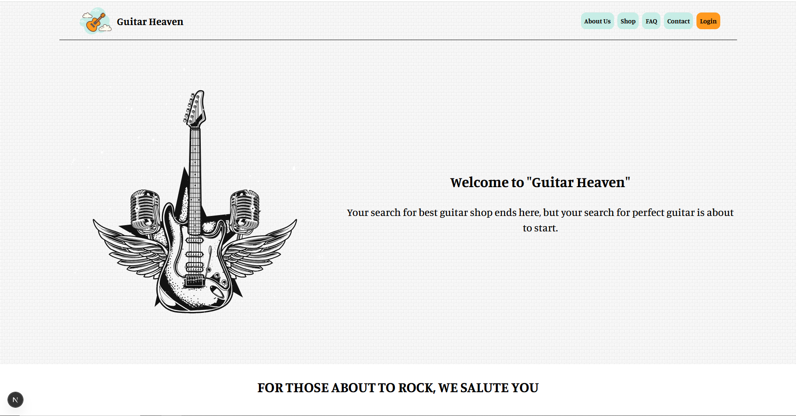

# GUITAR HEAVEN - Web Shop

A full-stack web application for an online guitar shop, including an admin and employee panel for managing guitar inventory in the warehouse.

## UNDER DEVELOPMENT

This appliaction is currently under development.
I======= 90% =======I

## TECHNOLOGIES

- **Frontend**: React (Next.js), SCSS (BEM)
- **Backend**: Spring Boot (Java)
- **Database**: MySQL
- **Auth**: JWT
- **Docker**

## HOW TO START APPLICATION

To run this application all you need to have is Docker (Docker desktop) installed, and IDE (I use Intellij IDEA Community).

- **Copy project**
- **Import in IDE**
- **Turn off local service if it is on**: If program have database problem, just change port number in    application.properties and docker file or turn off local server if it is on.
- **Project will build automaticali**: Maybe will ask for approval. Approve.
- **Start project**: In terminal enter: docker-compose up --build.
- **Enjoy** : When application is running login is posible with two users:
 Admin:
  Username: Admin21
  Password: Admin1234
  
 Employee:
  Username: Employee21
  Password: Employee1234

  There are no products in the database, but you can try to import one or few products and it will work.
- **Turn off**:  In terminal enter: docker-compose down.

  

## SNEAK PEEK
Welcome page

Login page 

Admin panel

Admin panel: create new Admin/Employee form

Admin panel: Admin/Employee table

Admin panel: create product form

Admin panel: view product

Admin panel: edit product

Employee panel

Example of electric guitars sections:
Example No:1

Example No:2

## DESCRIPTION OF THE APPLICATION

The application is designed as a web shop for selling guitars. It also serves as a system for tracking guitar inventory in the warehouse. Administrators have access to all inventory data and can perform standard CRUD operations. Employees also have access, but with limited permissions. Customers can browse and purchase products. The administrator is the main user responsible for managing the inventory — they can add, update, and delete guitars and employees. Employees can only view available guitars in storage. All guitars are visible in the store.
In the near future, a shopping cart and payment functionality will also be added.
